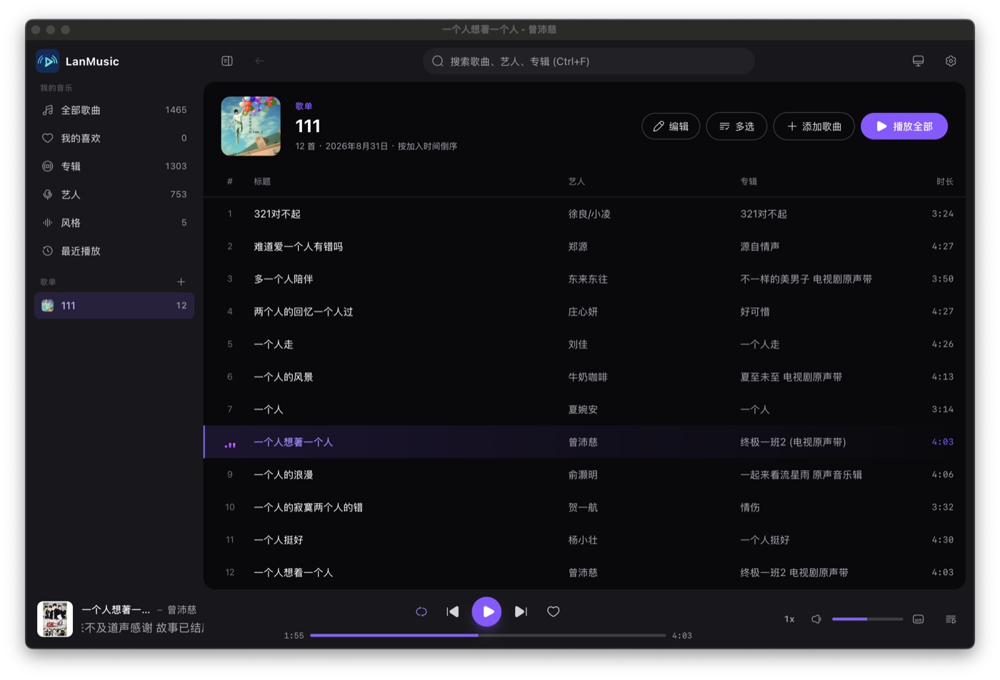
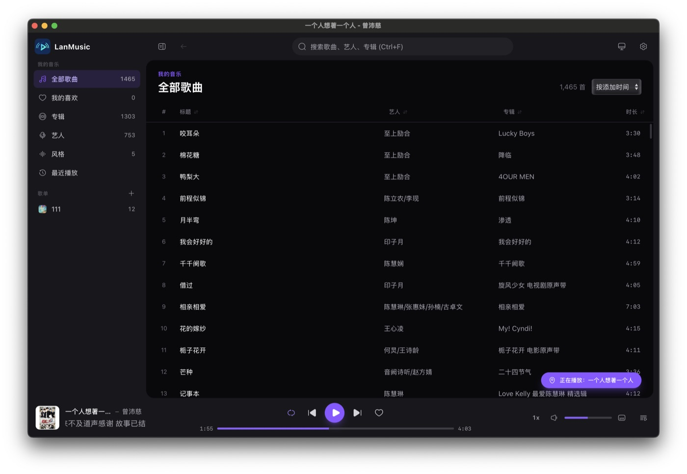

# LanMusic

本地 + 局域网音乐播放器（桌面端）。技术栈：**Tauri 2 + Vue 3 + TypeScript + Rust + SQLite**。

> 产品设计文档见 [docs/产品设计文档.md](docs/产品设计文档.md)。
> 当前进度：**M0-M3 已完成**（本地播放闭环 / 歌单 / 歌词 / 最近播放 / 托盘 / WebDAV 源），开发范围已**定稿**——剩余规划项不再实现，详见文末「路线图」。
>
> 最新功能：风格视图、本地目录监听自动增量扫描、WebDAV 凭证入系统钥匙串、封面缓存容量控制、播放倍速、队列另存为歌单、播放页 Hi-Res 音质徽标、单实例启动、歌词时间轴校准（播放页控件 + 快捷键，按曲目记忆）、专注模式、应用内更新（GitHub Releases）、图标库迁移 Solar Icons、界面卡片化布局。

## 界面预览

| 歌曲库 | 专辑视图 | 艺人视图 |
|:---:|:---:|:---:|
|  |  |  |

> 更多界面：风格视图、播放页、设置页可在运行应用后自行查看。

## 技术栈

| 层 | 技术 |
|---|---|
| 桌面框架 | Tauri 2（Rust 后端 + 系统 WebView，托盘 + 自定义流协议） |
| 前端 | Vue 3.5 + TypeScript 5.9 + Pinia 4 + Tailwind CSS 4 + GSAP 3 + Solar Icons |
| 后端 | Rust（edition 2021）· rusqlite（bundled SQLite，WAL）· lofty · reqwest · quick-xml |
| 构建 | Vite 8 + vue-tsc（严格模式，`noUnusedLocals` 等） |

## 功能总览

### M1 本地播放闭环

- **本地音乐库**：添加文件夹、增量扫描（mtime + size diff）、[lofty](https://docs.rs/lofty) 元数据解析
- **扫描性能**：独立 SQLite 连接（WAL 读写分离）、多线程并发解析（共享任务队列，不持锁）、封面惰性提取、枚举/解析双阶段进度上报
- **快速导入**：针对网络目录的开关，仅按文件名/目录结构入库；「完整解析」随时补全标签
- **`music://` 自定义流协议**：HTTP Range 拖动进度、2MB 分块封顶、本地/WebDAV 统一路由、跨平台适配（macOS `music://` / Windows `http://music.localhost`）
- **播放**：播放模式（顺序/列表循环/单曲/随机）、队列管理、虚拟滚动列表（10 万级）、专辑/艺人/风格视图、搜索、全局快捷键（空格 / `N` / `P` / `Ctrl+F` / `[` / `]`）
- **目录监听**：本地来源目录接入 notify 监听，文件变化（新增/修改/删除/重命名）自动触发增量扫描（去抖 3s；WebDAV 源无法监听，需手动重扫）

### M2 库体验

- **歌单**：
  - 基本信息：名称、简介、创建时间、歌曲数量
  - 歌单封面：自动使用最新加入歌曲的专辑封面
  - 添加歌曲：搜索勾选面板（支持"全部/已选"视图切换、全选/清空、已在歌单禁选）
  - 排序：按加入时间倒序（新添加的歌曲在最前面）
  - 批量操作：多选模式支持播放/加入队列/移出歌单
  - 编辑集中化：通过统一弹层管理名称、简介、删除
- **歌词**：`.lrc` 同名文件 + 内嵌歌词（USLT/LYRICS）；播放页大封面 + 时间轴滚动歌词（点击行跳转）；间奏空行折叠
- **歌词校准**：播放页右下角「后退 / 还原 / 前进」控件（或快捷键 `[` / `]`），每次 ±0.5s、范围 ±10s；偏移按曲目持久化，toast 原地更新累计量（连续点击不叠加提示框）
- **最近播放**（`play_count` / `last_played_at` 统计）
- **喜欢**（收藏）
- **歌曲淡入淡出**：播放/暂停与切歌时音量平滑过渡（淡入 0.8s、淡出 0.6s），设置页可开关
- **播放倍速**：播放条右侧循环切换 0.5x–2x（`0.5/0.75/1/1.25/1.5/2`），倍速跨切歌延续，持久化到 `lm.rate`；非 1x 时按钮高亮
- **队列另存为歌单**：队列面板「保存」按钮，把当前队列整体保存为新歌单（按保存时间命名）并跳转
- **音质徽标**：播放页显示格式/采样率/位深/码率，≥88.2kHz 或 ≥24bit 标记金色 Hi-Res
- **风格视图**：按曲目标签中的 Genre 归类浏览（侧栏「风格」入口，点击进入该风格的歌曲列表）
- **封面缓存容量控制**：默认上限 500MB，启动与扫描结束后自动清理（先删哨兵文件，再按修改时间从旧到新删封面；可通过 `covers.max_mb` 设置调整，0 = 不限制）
- **单实例**：重复启动时唤起已运行实例的主窗口（`tauri-plugin-single-instance`）
- **应用内更新**：启动时静默检查 GitHub Releases 的 `latest.json`，设置 → 关于可手动检查；发现新版本显示版说明与下载进度，下载完成后重启安装；更新包经 Tauri minisign 密钥校验（免费本地签名，非 OS 代码签名）
- **阻止系统休眠**：播放歌曲期间保持系统与屏幕常亮（默认开启），暂停/停止后自动恢复；Windows 走 `SetThreadExecutionState`，其他平台尝试 Web Wake Lock
- **系统托盘**：点击托盘图标弹出悬浮菜单（圆角玻璃卡片）——顶部显示当前歌曲封面+歌名/歌手，控制栏提供上一首/播放暂停/下一首/喜欢，底部为桌面歌词开关/设置/退出；失焦自动收起
- **侧栏**：可收起/展开（GSAP 宽度动画 + 文字淡入淡出 + 图标尺寸过渡），歌单显示封面缩略图
- **专注模式**：播放页播放中，鼠标 5 秒无操作自动隐藏顶栏与播放条（移动鼠标即恢复）；皮肤设置弹层展开、暂停时不会触发隐藏
- **界面布局**：内容区卡片化（白色圆角浮于灰底，与侧栏/顶栏/播放条分区）；播放条随播放页上下文自适应配色

### M3 局域网

- **WebDAV 源**：PROPFIND 遍历、Range 拉文件头 1MB 解析标签、外挂 lrc/封面 URL 记录（设置页添加）；密码存系统钥匙串，数据库仅保存用户名
- **远程流统一代理**：Rust 侧转发 Range（2MB 分块），凭证不出进程

### 支持的格式

- **音频扩展名**：`mp3` `flac` `m4a` `aac` `ogg` `oga` `opus` `wav` `aif` `aiff` `wma` `ape`
- **外挂封面文件名**（与音频同目录）：`cover.jpg|jpeg|png`、`folder.jpg|png`、`front.jpg|png`（也支持内嵌封面，惰性提取）
- **外挂歌词**：与音频同名的 `.lrc` 文件；或标签内嵌歌词（ID3v2 USLT / Vorbis LYRICS / M4A）
- 标签解析失败的文件自动降级为「文件名入库」（`meta_state=0` 标记，可随时「完整解析」补全）

## 环境要求

- Node 22+（包管理器 pnpm，见 `packageManager` 字段）
- Rust 1.85+（含各平台 WebView 运行时）

## 快速开始

```bash
pnpm install          # 前端依赖
pnpm tauri:dev        # 开发模式（首次需编译 Rust，约 2-3 分钟）
pnpm tauri:build      # 打包安装程序
```

## GitHub Actions 打包

`.github/workflows/build.yml` 提供云端打包，矩阵产出 4 类安装包：

| Runner | Target | 产物 | 覆盖硬件 |
|---|---|---|---|
| macos-latest（M 芯片） | `aarch64-apple-darwin` | `.dmg` / `.app` | Apple Silicon（M1-M4） |
| macos-latest（M 芯片交叉编译） | `x86_64-apple-darwin` | `.dmg` / `.app` | Intel Mac |
| windows-latest | `x86_64-pc-windows-msvc` | NSIS `.exe` / `.msi` | Intel 与 AMD 桌面 CPU（同为 x86_64，一个包通用） |

使用方式：

1. 把仓库推到 GitHub（当前远端为内网 Git，可在 GitHub 建仓后添加远端推送）；
2. **配置应用内更新**（一次性）：
   - 仓库 → Settings → Secrets and variables → Actions → New repository secret，添加 `TAURI_SIGNING_PRIVATE_KEY`，值为私钥文件 `~/.tauri/lanmusic.key` 的**全文**（私钥无密码，`TAURI_SIGNING_PRIVATE_KEY_PASSWORD` 无需配置）；
   - 全局替换 `src-tauri/tauri.conf.json` 中 updater 端点的 `YOUR_GITHUB_USERNAME` 为你的 GitHub 用户名/组织名，端点形如 `https://github.com/<owner>/<repo>/releases/latest/download/latest.json`；
3. 触发构建二选一：
   - Actions 页面手动 **Run workflow**（`workflow_dispatch`）；
   - 打标签自动触发：`git tag v0.1.0 && git push origin v0.1.0`；
4. 构建完成后在 **Releases** 中会出现**草稿 Release**，检查无误后手动 Publish（发布后 `latest.json` 生效，旧版本应用即可收到更新提示）。

说明：

- Release 版本号取自 `src-tauri/tauri.conf.json` 的 `version`，打 tag 时保持与之一致（如 `v0.1.0`）；**发新版记得同步更新该 version**，应用内更新靠版本号对比判定；
- `tauri-action` 会随安装包一起上传 `latest.json` 与各包的 `.sig` 签名文件（`createUpdaterArtifacts: true` + `includeUpdaterJson: true`）；
- 安装包均**未做 OS 代码签名**（范围定稿）：macOS 首次打开需右键 → 打开（或 `xattr -cr /Applications/LanMusic.app`）；Windows SmartScreen 提示选择「仍要运行」；
- 若需要 macOS 通用二进制（一个包同时跑两种架构），把两个 macOS 条目的 `target` 都改为 `universal-apple-darwin` 即可（包体积约增大一倍）。


## 常用命令

| 命令 | 说明 |
|---|---|
| `pnpm dev` | 仅启动 Vite 前端（浏览器调试，无 Tauri 壳） |
| `pnpm tauri:dev` | 桌面应用开发模式 |
| `pnpm tauri:build` | 打包各平台安装程序 |
| `pnpm typecheck` | 前端 TypeScript 类型检查（`vue-tsc --noEmit`） |
| `pnpm test` | 运行 Rust 单元测试（`cargo test`） |
| `pnpm clippy` | Rust lint 检查 |
| `pnpm fmt` / `pnpm fmt:check` | Rust 代码格式化 / 仅检查 |
| `pnpm verify` | 提交前一键校验（typecheck + test + clippy） |
| `pnpm build` | 产物构建（含类型检查 + Vite 打包） |

## 目录结构

```
src/                       # Vue 3 前端
├── api/
│   ├── commands.ts        # invoke 封装（与 Tauri 交互的唯一边界）
│   └── scheme.ts          # music:// / cover:// URL 构建（按平台分流）
├── stores/
│   ├── player.ts          # 播放状态机：队列/模式/歌词/恢复/错误重试
│   └── library.ts         # 库数据：来源/扫描进度/歌单/分页查询
├── components/            # PlayerBar / TrackTable(虚拟滚动) / TrackPicker(选歌面板) / PlaylistEditDialog / Tooltip / QueuePanel / NowPlayingView ...
├── views/                 # Tracks / Albums / Artists / Playlist / Settings
├── composables/           # useNav / useTheme / useSkin / useSpectrum / useAmbient / useToast ...
├── utils/                 # lrc 解析 / 取色 / 平台判断
└── types.ts               # 与 Rust DTO 对应的 TS 类型

src-tauri/                 # Rust 后端
└── src/
    ├── lib.rs             # 应用入口：窗口/托盘/协议注册/命令注册/封面自愈
    ├── commands.rs        # IPC 命令层：参数校验 + 数据库薄封装
    ├── db.rs              # SQLite schema + 列迁移 + KV 设置
    ├── scanner.rs         # 增量扫描管线（local/webdav 两来源，后台线程 + 进度事件）
    ├── metadata.rs        # lofty 元数据解析（含远程头部字节解析）
    ├── scheme.rs          # music:// 音频流协议（Range 代理/转发）、cover:// 封面协议
    ├── covers.rs          # 封面惰性提取与缓存（哨兵文件防重复网络 I/O）
    ├── lyrics.rs          # 歌词获取：外挂 .lrc / 内嵌 / 远程接口
    ├── network.rs         # WebDAV 客户端（PROPFIND / 下载）
    └── state.rs           # AppState（DB 连接、扫描去重、共享句柄等）
```

## 架构

```
┌─────────────────────────── WebView（Vue 3 + Pinia）───────────────────────────┐
│   views / components（TrackTable 虚拟滚动 · NowPlayingView · QueuePanel …）    │
│   stores：player（播放状态机） · library（库数据）                             │
│        │ invoke（IPC，27 个命令）          ▲ listen（事件推送）                │
└────────┼───────────────────────────────────┼─────────────────────────────────┘
         ▼                                   │
┌─────────────────────────── Rust（Tauri 2）────────────────────────────────────┐
│   commands.rs ── IPC 命令层（参数校验 + SQLite 薄封装）                        │
│        │                        │                          │                  │
│        ▼                        ▼                          ▼                  │
│   scanner.rs              scheme.rs                  network.rs               │
│   两来源扫描管线      music:// / cover:// 流协议    WebDAV 客户端              │
│   （后台线程+进度）   本地读盘 / 远程代理认证       （PROPFIND / 下载）        │
│        │                        │                          │                  │
│        ▼                        ▼                          ▼                  │
│   covers.rs（封面惰性提取） lyrics.rs（歌词） metadata.rs（lofty 标签）        │
│                        db.rs（SQLite WAL，独立连接读写分离）                   │
└──────────────────────────────────────────────────────────────────────────────┘
```

### 核心机制

- **音频流**：前端 `<audio>` 的 src 指向自定义协议；Rust 侧按来源类型路由——本地直接读文件流，WebDAV 经代理转发并附带 Basic 认证，凭证不出进程。Range 请求统一 2MB 封顶，媒体引擎自动续传。
- **扫描管线**：枚举（实时进度）→ diff（mtime/size/meta_state）→ 多线程并发解析（不持锁）→ 独立连接分批事务入库（每 100 首提交 + 进度上报）→ 删除已消失文件并清理孤儿专辑与封面缓存。
- **封面缓存**：`covers/{album_id}.jpg`，失败写 `{id}.none` 哨兵；删除专辑时同步清理缓存文件，防止 SQLite rowid 复用导致「歌和封面对不上」。
- **播放状态恢复**：队列快照（ids + index）与进度存 localStorage，启动时按 id 批量还原（分批 IN 查询），已删除曲目自动跳过。

## 键盘快捷键

| 按键 | 作用 |
|---|---|
| `空格` | 播放 / 暂停 |
| `N` | 下一首 |
| `P` | 上一首 |
| `Ctrl/⌘ + F` | 聚焦搜索框 |
| `[` | 歌词后退 0.5s（延后显示，歌词显示快了用这个） |
| `]` | 歌词前进 0.5s（提前显示，歌词显示慢了用这个） |
| `Esc` | 关闭播放页 |

> 输入框中输入时不触发（`Ctrl+F` 除外）。

## IPC 命令参考

前端与 Rust 的全部交互边界（`src/api/commands.ts` ↔ `src-tauri/src/commands.rs`）：

| 分组 | 命令 |
|---|---|
| 来源管理 | `add_local_source(path)` · `list_sources()` · `remove_source(id)` · `rescan_source(id, mode: auto\|full)` · `set_source_fast_import(id, enabled)` · `webdav_add_source(url, username, password, name?)` |
| 曲库查询 | `query_tracks({view, refId, genre, search, sort, page, pageSize})` · `query_albums(search, page, pageSize)` · `query_artists(search, page, pageSize)` · `query_genres(search, page, pageSize)` · `get_track(id)` · `get_tracks_by_ids(ids)` · `get_stream_url(id)` · `library_stats()` · `reveal_track(id)` |
| 歌单 | `playlist_list` · `playlist_create(name)` · `playlist_rename(id, name)` · `playlist_delete(id)` · `playlist_get_items(id)` · `playlist_add_tracks(id, trackIds)` · `playlist_remove_track(id, trackId)` · `playlist_remove_tracks(id, trackIds)` · `playlist_set_description(id, description)` · `playlist_cover(id)` · `playlist_reorder(id, trackIds)` |
| 播放/歌词/喜欢 | `report_play(id)` · `get_lyrics(id)` · `favorite_toggle(id, fav)` · `set_thumbbar_playing(playing)`（Windows 任务栏缩略图按钮图标同步） · `desktop_lyrics_set(enabled)`（桌面歌词浮窗开关） · `list_system_fonts()`（系统字体列表） · `set_prevent_sleep(prevent)`（播放时阻止系统休眠/锁屏） |
| 设置 | `get_setting(key)` · `set_setting(key, value)` |

`query_tracks` 支持的 `sort` 值：`title` `-title` `album` `-album` `artist` `-artist` `added` `duration` `-duration` `recent` `none`（`-` 前缀为降序）。

## 事件（Rust → 前端）

| 事件 | 载荷 | 说明 |
|---|---|---|
| `scan:progress` | `{sourceId, phase: "enumerate"\|"parse", done, total, current}` | 扫描进度（enumerate 阶段 total 未知） |
| `scan:done` | `{sourceId, added, updated, removed, ms}` | 扫描完成统计 |
| `scan:error` | `{sourceId, message}` | 扫描失败 |
| `tray` | `"toggle"` \| `"prev"` \| `"next"` \| `"fav"` | 系统托盘菜单操作 / Windows 任务栏缩略图控制按钮 |

### 窗口间事件（前端 → 前端，桌面歌词 / 托盘菜单同步）

| 事件 | 方向 | 载荷 | 说明 |
|---|---|---|---|
| `lyrics:sync` | 主窗口 → 歌词浮窗 | `{lines: [行1, 行2], active: 0\|1, config, playing}` | 双行交替：`active` 指明播放行所在位置，行/配置/播放状态变化即推送 |
| `lyrics:ready` | 歌词浮窗 → 主窗口 | - | 浮窗就绪，主窗口立即补推一次 |
| `lyrics:control` | 歌词浮窗 → 主窗口 | `"prev" \| "toggle" \| "next" \| "close" \| "calib-back" \| "calib-forward" \| "calib-reset"` | 浮窗控制条指令（切歌/关闭/歌词校准），由播放器执行 |
| `tray:sync` | 主窗口 → 托盘弹窗 | `{title, artist, albumId, playing, fav, deskLyrics, font}` | 曲目/播放/喜欢/桌面歌词状态变化即推送 |
| `tray:ready` | 托盘弹窗 → 主窗口 | - | 弹窗就绪，主窗口立即补推一次 |
| `tray:action` | 托盘弹窗 → 主窗口 | `"show" \| "lyrics" \| "settings" \| "quit"` | 系统级指令：显示主窗口 / 切换桌面歌词 / 跳转设置 / 退出应用 |

## 数据库结构

SQLite（WAL 模式，外键开启），建表与列迁移见 `src-tauri/src/db.rs`：

| 表 | 说明 |
|---|---|
| `sources` | 音乐来源：`kind`(local/webdav)、`base_path`/`base_url`、`config`(JSON：WebDAV username，密码存系统钥匙串)、`fast_import` |
| `artists` | 艺人（名称唯一，不分大小写） |
| `albums` | 专辑：`key` 唯一键（`标题\|合辑艺人\|年份` 小写）、`has_cover`、`cover_url`(WebDAV) |
| `tracks` | 曲目：`path`(来源内唯一)、标签/音频属性、`fav`、`play_count`/`last_played_at`、`meta_state`(0=快速导入待补全) |
| `playlists` / `playlist_items` | 歌单与条目（`playlists` 新增 `description` 简介列；`playlist_items` 新增 `added_at` 时间戳，按加入时间倒序排列，级联删除） |
| `lrc_files` | 外挂歌词：`track_id` 主键；`path` 为本地路径（local）或完整 URL（webdav） |
| `app_settings` | KV 设置及内部标记（如封面缓存自愈版本号、封面缓存上限 `covers.max_mb`，默认 500） |

## 前端持久化（localStorage）

| 键 | 内容 |
|---|---|
| `lm.queue` | 队列快照 `{ids, index}` |
| `lm.lastTrack` / `lm.lastPos` | 上一首曲目 id / 播放进度（秒） |
| `lm.volume` / `lm.muted` / `lm.mode` | 音量 / 静音 / 播放模式 |
| `lm.rate` | 播放倍速（0.5/0.75/1/1.25/1.5/2） |
| `lm.sort` | 曲目列表排序 |
| `lm.skin` | 频谱皮肤 `{on, style: particles\|tree}` |
| `lm.theme` | 主题模式 `light\|dark\|system`（默认 dark） |
| `lm.nav` | 上次停留的视图（含筛选上下文，启动时恢复） |
| `sidebar:collapsed` | 侧栏是否收起 |
| `lm.lrcOffset.<trackId>` | 歌词偏移（秒，按曲目记忆，见「歌词校准」） |
| `lm.font` | 全局字体（CSS font-family 字符串，空 = 软件默认字体栈） |
| `lm.deskLyrics` | 桌面歌词 `{enabled, config: {lines, align(left\|center\|right\|split), color, pendingColor, fontSize, bgColor, bgOpacity, outline, outlineColor, bold}}` |
| `lm.fade` | 歌曲淡入淡出开关（`'1'` = 开启，默认关闭） |
| `lm.preventSleep` | 播放时阻止系统休眠/锁屏（`'0'` = 关闭，默认开启） |

## 安全设计

- WebDAV 凭证存系统钥匙串（macOS Keychain / Windows Credential Manager / Linux Secret Service，条目 `com.lanmusic.desktop` / `webdav/{source_id}`），不写入日志、不随扫描事件外发；钥匙串不可用时回退明文存库；远端流经本机 Rust 代理转发，凭证不出进程
- 应用纯本地运行，不上传任何数据

## 数据位置

- 数据库：`~/Library/Application Support/com.lanmusic.desktop/library.db`（macOS）；Windows 为 `%APPDATA%\com.lanmusic.desktop\library.db`
- 封面缓存：同目录 `covers/` 下，按专辑 ID 命名
- 前端持久化（队列快照/偏好）：WebView localStorage

## 开发指南

**新增一个 IPC 命令**（四步）：
1. `src-tauri/src/commands.rs`：编写 `#[tauri::command]` 函数（入参用 camelCase，Tauri 自动映射）
2. `src-tauri/src/lib.rs`：在 `invoke_handler` 的 `generate_handler!` 列表中注册
3. `src/api/commands.ts`：添加类型化封装（保持「api 层是唯一 IPC 边界」的约定）
4. `src/types.ts`：补充对应的 TS 类型（注意 Rust DTO 的 `#[serde(rename_all = "camelCase")]`）

**新增一列数据库迁移**：在 `db.rs::migrate()` 中调用 `ensure_column(conn, 表名, 列名, 定义)`，不要直接改 `SCHEMA` 常量。

**运行与调试**：
- `pnpm tauri:dev`（Rust 改动会自动重编译；前端 HMR 端口 1420/1421）
- `pnpm test` — `scheme.rs` 中有跨平台 URI 解析的单测，改协议相关代码请补测试
- 提交前跑 `pnpm verify`（typecheck + cargo test + clippy）

**窗口平台差异**：macOS 保留原生红绿灯（透明标题栏）；Windows/Linux 无边框，由前端 `WindowControls` 自绘。自定义协议 URL 形态不同（`music://track/1` vs `http://music.localhost/track/1`），前端统一走 `api/scheme.ts`，不要手拼。

## 故障排查

| 现象 | 原因与处理 |
|---|---|
| WebDAV 的 M4A 缺时长 | moov box 在文件尾，头部 1MB 解析不到；属于已知取舍 |
| 封面显示错乱（旧版本库） | 启动时会一次性自愈清空封面缓存（`covers.selfheal.v1`），之后惰性重建 |
| Windows 首次运行提示 SmartScreen | 安装包未签名（已定稿不计划签名），选择「仍要运行」即可 |
| 某些歌曲显示文件名而非标签 | 标签解析失败已降级入库；对来源执行「完整解析」重试 |

## 路线图（开发范围已定稿）

功能开发到此为止，**以下规划项明确不再实现**：

| 功能 | 不做的理由 |
|---|---|
| 系统媒体键（SMTC/MPRIS） | 已有应用内快捷键、系统托盘菜单、Windows 任务栏缩略图按钮，覆盖控制需求 |
| 打包签名（OS 代码签名） | 依赖付费开发者账号与代码签名证书（外部资源），不做；更新包签名用 Tauri 自带 minisign 密钥（免费），已用于应用内更新 |
| FTS 全文搜索（含拼音首字母） | 现 LIKE 搜索在十万级曲库下体验可接受 |
| 文件夹视图 | 专辑/艺人/风格视图已覆盖浏览需求 |
| 歌词编辑器 | 歌词为只读展示，不提供编辑 |
| 转码兜底（symphonia） | 主流格式 WebView 已可解码，非主流格式明确标注 |
| 智能歌单 | 规则歌单需求可用现有歌单手动维护替代 |
| Rust 音频引擎（gapless / ReplayGain / EQ / DSD） | 替换播放内核属重写级工程，收益/风险比不划算 |
| DLNA/UPnP、SMB 原生客户端、远程控制 Web 页 | P2 规划整体取消 |

- **已完成**：M0-M3 全部 + 歌单升级（添加歌曲面板、封面、简介、批量操作、加入时间排序）、歌词时间轴校准（控件 + `[`/`]` 快捷键 + 按曲目持久化 + toast 去重）、专注模式、播放倍速、队列另存为歌单、播放页 Hi-Res 音质徽标、风格视图、本地目录监听自动增量扫描、WebDAV 凭证入系统钥匙串、封面缓存容量控制、单实例启动、应用内更新（GitHub Releases）、图标库迁移 Solar Icons、界面卡片化布局与视觉细节统一、导航相同路由去重、侧栏收起动画优化、主题图标优化（自动=SunMoon/暗=Moon/亮=Sun）
- **已移除**：局域网共享模式与设备发现（历史实现见 git 记录）
- 已知取舍：
  - WebDAV 标签解析基于文件头部 1MB（moov 在尾部的 M4A 可能缺时长）
  - 歌词为只读展示（不提供编辑器）
  - WebDAV 源无法目录监听（远端文件系统变化对本机不可见），需手动「重新扫描」
  - 安装包不计划签名，Windows 首次运行 SmartScreen 提示属正常现象

