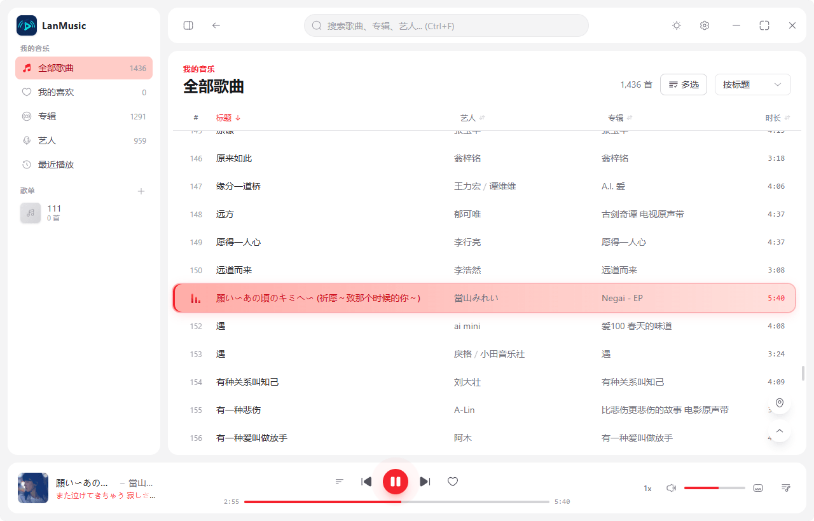
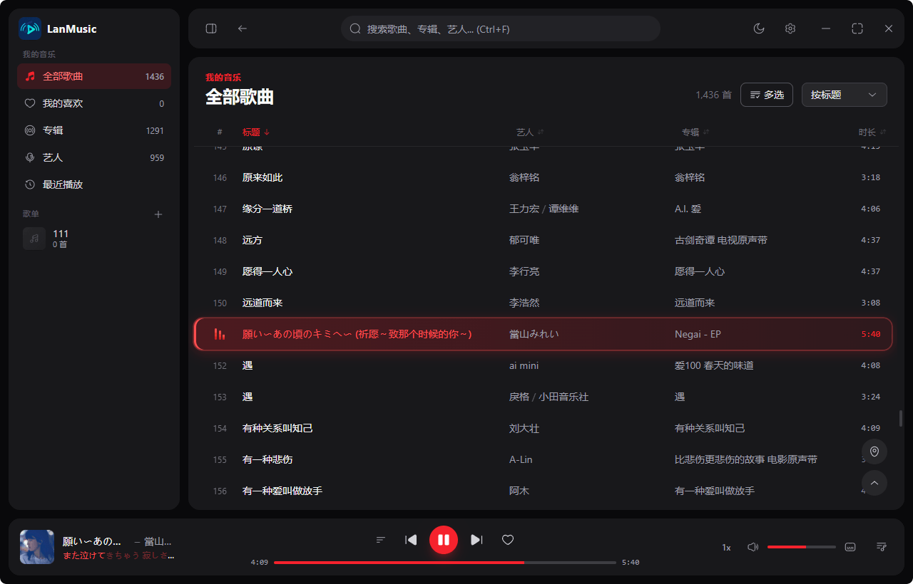

# LanMusic

本地 + 局域网音乐播放器（桌面端）。技术栈：**Tauri 2 + Vue 3 + TypeScript + Rust + SQLite**。

> 产品设计文档见 [docs/产品设计文档.md](docs/产品设计文档.md)。
> 当前进度：**本地播放闭环 / 歌单 / 歌词 / 最近播放 / 托盘 / WebDAV 源已完成**，应用已进入稳定维护阶段。
>
> 主要能力：本地与 WebDAV 音乐库、歌词（外挂 .lrc / 内嵌）、歌单、智能歌单、文件夹视图、最近播放、均衡器与音量归一化、播放倍速与淡入淡出、睡眠定时器、系统级「正在播放」（SMTC / Now Playing / MPRIS）与全局媒体键、专注模式、桌面歌词浮窗、封面缓存、Windows 任务栏缩略图控制、系统托盘、应用内更新（GitHub Releases）。

## 界面预览

| 亮色 | 暗色 | 自定义背景 | 播放页 |
|:---:|:---:|:---:|:---:|
|  |  |  |  |

> 预览基于真实曲库数据；自定义背景为设置 → 外观中选定的背景图效果，其余界面可在运行应用后自行查看。

## 技术栈

| 层 | 技术 |
|---|---|
| 桌面框架 | Tauri 2（Rust 后端 + 系统 WebView，托盘 + 自定义流协议） |
| 前端 | Vue 3.5 + TypeScript 5.9 + Pinia 4 + Tailwind CSS 4 + GSAP 3 + Solar Icons |
| 后端 | Rust（edition 2021）· rusqlite（bundled SQLite，WAL）· lofty · reqwest · quick-xml |
| 构建 | Vite 8 + vue-tsc（严格模式，`noUnusedLocals` 等） |

## 功能总览

### M1 本地播放闭环

- **本地音乐库**：添加文件夹、增量扫描（mtime + size diff）、[lofty](https://docs.rs/lofty) 元数据解析
- **扫描性能**：独立 SQLite 连接（WAL 读写分离）、多线程并发解析（共享任务队列，不持锁）、封面惰性提取、枚举/解析双阶段进度上报
- **快速导入**：针对网络目录的开关（本地与 WebDAV 来源通用），仅按文件名/目录结构入库、不读文件内容；本地来源省掉标签解析，WebDAV 来源还会**完全跳过逐文件的头部拉取**（大库首次导入能省下大量请求，也不易触发远端限流）；「完整解析」随时补全标签，且**无视该开关**（一定会真实解析，含已快速导入的歌曲）
- **`music://` 自定义流协议**：HTTP Range 拖动进度、2MB 分块封顶、本地/WebDAV 统一路由、跨平台适配（macOS `music://` / Windows `http://music.localhost`）
- **播放**：播放模式（顺序/列表循环/单曲/随机）、队列管理、上一曲始终切换到队列上一首（不回本曲开头；队首且循环模式时回末尾）、虚拟滚动列表（10 万级）、专辑/艺人视图、搜索、全局快捷键（空格 / `N` / `P` / `Ctrl+F` / `[` / `]`）
- **扫描范围**：按目录名跳过——内置 `#recycle` / `#snapshot` / `@eaDir` / `$RECYCLE.BIN` / `System Volume Information` / `lost+found` / `.Trash*` 等 NAS 回收站与系统目录（共 10 条，见 `scanner.rs::BUILTIN_SKIP_DIRS`），设置页可按目录名追加（不区分大小写，任何层级命中即整棵剪掉）；设置页把内置的这批目录名以「内置」标记单独列出（数据来自 `get_builtin_skip_dirs`，避免用户误以为需要手动添加）；每来源可开关「子目录扫描」，关闭后仅扫描根目录下的文件（本地/WebDAV 通用，目录监听模式随之切换）
- **目录监听**：本地来源目录接入 notify 监听，文件变化（新增/修改/删除/重命名）自动触发增量扫描（去抖 3s；监听模式跟随来源的「子目录扫描」开关；WebDAV 源无法监听，需手动重扫）

### M2 库体验

- **歌单**：
  - 基本信息：名称、简介、创建时间、歌曲数量
  - 歌单封面：自动使用最新加入歌曲的专辑封面
  - 添加歌曲：搜索勾选面板（支持"全部/已选"视图切换、全选/清空、已在歌单禁选）
  - 排序：默认按加入时间倒序，表头点击可按标题/艺人/专辑/时长排序（升序 → 降序 → 还原三态）；文本列与曲库同款拼音分组序（后端 `PINYIN` collation 排序）；歌单名上限 25 字，被截断时悬停显示全名
  - 批量操作：多选模式支持播放/加入队列/移出歌单
  - 编辑集中化：通过统一弹层管理名称、简介、删除
  - 新建与重命名走同一个弹层：新建只填名称；侧栏右键「重命名」弹出的弹层预填当前名字、只改名称（简介与删除留给「编辑歌单」与右键删除入口）
- **智能歌单**：侧栏「智能歌单」页，按规则即时生成曲目列表（不入库、不落盘，随曲库变化自动反映）——**最近添加**（按入库时间倒序）、**最近播放**（有播放记录、按最后播放时间倒序）、**常听**（按播放次数倒序）、**我喜欢**（收藏曲目）、**从未播放**（播放次数为 0）、**随机漫游**（每次进入重新洗牌）；每类上限 200 首（后端 `smart_playlist(kind, limit)`，可调 1–5000）；切换规则用顶部标签，列表复用曲库的虚拟滚动表格（可右键、可多选、可整列播放）
- **文件夹视图**：侧栏「文件夹」页，按音乐文件在磁盘上的**实际目录结构**浏览（区别于按标签聚合的专辑/艺人视图）——面包屑显示当前路径、可逐级点回上层；目录项显示名称与该目录下的曲目数；进入目录列出直属曲目（子目录另起分组），列表复用曲库表格。目录树由曲目 `path` 直接推导（`query_folders(parent)` / `query_tracks_by_folder(folder)`，按目录名拼音排序），无需额外建表，也不受标签缺失影响
- **歌词**：`.lrc` / `.qrc` 同名文件 + 内嵌歌词（USLT/LYRICS，本地与 WebDAV 来源都支持）；播放页大封面 + 时间轴滚动歌词（点击行跳转）；QRC 逐字歌词按字高亮（Apple Music 式卡拉OK效果，覆盖播放页歌词面板 / 底部播放条单行歌词 / 桌面歌词浮窗，Rust 侧解析，QQ 音乐加密 .qrc 自动解密——新旧两种加密格式均支持）；**增强版 LRC**（Enhanced LRC / A2，行内 `<mm:ss.xx>` 字级时间戳）**与多标签逐字 LRC**（`[00:00.000]身[00:00.582]骑…`）同样按字高亮，与 QRC 共用一套渲染链路（前端 `parseWordLrc()` 统一解析，两种结构自动识别，可混排）；间奏空行折叠；**歌词来源优先级**可设置（外挂 QRC / 外挂 LRC / 内嵌歌词任意顺序，默认 QRC 优先，设置页「歌词」标签，变更后当前歌曲立即生效）；歌词文件读取自动识别编码（UTF-8 / GBK / GB18030，QQ 生态歌词常见 GBK 不再乱码）；**歌词副行（音译 / 译文）**（按歌词文件的行序排布：音译（罗马字）在上、原文居中、译文在下；同起点的副行自动识别并合并——三行逐字歌词不再显示成三个重复行；音译与译文在播放页歌词区各有文字开关（`音` / `译`），**默认关闭**、按曲目记忆，仅当该曲歌词里确实带这条副行时才出现按钮）
- **歌词校准**：播放页右下角「后退 / 还原 / 前进」控件（或快捷键 `[` / `]`），每次 ±0.5s、范围 ±10s；偏移按曲目持久化，toast 原地更新累计量（连续点击不叠加提示框）；同一浮层分隔线下方是**歌词副行开关**——`音`（音译 / 罗马字）与 `译`（译文）两个文字按钮，默认关闭，仅当前歌词确实带该副行时才出现（没有的直接不显示），点开后为主题色底 + 主题色字
- **最近播放**（`play_count` / `last_played_at` 统计；列表最多展示最近 500 首，超出部分不显示，重新播放会重新进入列表）
- **听歌统计**：侧栏「听歌统计」页（入口**默认隐藏**，设置 → 通用可开启），分两个标签：
  - **收听统计**——汇总卡（累计 / 今日 / 近 7 天收听时长、总播放次数、有效播放次数（一曲一天一次）、独立曲目 / 艺人数、连续听歌天数（当前与最长））；收听趋势柱状图（按日 / 周 / 月切换）；**星期 × 小时热力图**（看一周内什么时段听得最多）；「听得最多的歌」榜单（曲目 / 艺人 / 专辑 / 流派 四类 × 周 / 月 / 全部）
  - **音乐库体检**——曲库概览（曲目 / 专辑 / 艺人 / 流派数、总时长、总大小）；覆盖率（歌词（内嵌 / 外挂 / 逐字细分）、封面、MV 关联、元数据完整率六字段）；分布（格式、来源、采样率、位深、年份）；最近扫描历史（增 / 改 / 删 / 耗时）
  - **诊断**——性能与诊断指标（进程内内存态，重启清零）：环境与版本（应用 / Tauri / WebView2 / 系统 / 运行时长 / Rust setup 耗时 / 内存 / CPU 即时采样）；WebDAV 请求计数、成功率与平均耗时；封面缓存命中率与提取成败；歌词加载成败与耗时；播放启动延迟（次数 / 平均 / 最大）；panic 与前端错误计数；最近一次扫描的分段耗时
  - 统计的是**实际收听秒数**（暂停、快进跳过、缓冲卡顿不计），流水存本地 `play_history` 表，随曲目删除级联清理，数据不出本机
- **喜欢**（收藏）
- **多选批量操作**：全部歌曲 / 喜欢 / 最近播放 / 专辑 / 艺人 / 搜索结果与歌单页均支持多选（播放 / 加入队列 / 添加到歌单），歌单页可移出歌单，曲库侧可从曲库移除（不删磁盘文件）；「添加到歌单」的歌单选择菜单从底部操作栏上方弹出（带展开动画）
- **中文拼音排序**：全部歌曲 / 专辑 / 艺人列表按标题 / 专辑 / 艺人排序（含表头点击升降序）按「数字 → 字母 → 汉字」分组——数字段按数值序（`2` 在 `10` 前）、汉字组内按拼音、英文大小写不敏感；空专辑 / 艺人排最后。实现为 SQLite 自定义 collation（`PINYIN`，见 `db.rs::open_conn`）
- **已移除歌曲**：手动移除与扫描时文件消失的曲目都会留底（设置 → 已移除歌曲），记录歌名/艺人/专辑/路径与移除原因，便于找回；支持单条或全部还原（确认文件仍在后自动扫描重新入库）；上限 1000 条自动裁剪
- **艺人合并**：艺人名规整（「陈奕迅（Eason Chan）」→「陈奕迅」）一键归并；设置页展示已合并名单，支持自定义合并（两位名字不同的艺人实为同一人时手动归并）。旧名记为别名（`artist_aliases`），之后扫描遇到旧名仍归到主艺人名下，不会重新建出独立艺人
- **歌曲淡入淡出**：播放/暂停与切歌时音量平滑过渡（淡入 0.8s、淡出 0.6s），**默认开启**，设置页可关闭
- **播放倍速**：播放条右侧循环切换 0.5x–2x（`0.5/0.75/1/1.25/1.5/2`），倍速跨切歌延续，持久化到 `lm.rate`；非 1x 时按钮高亮
- **均衡器 / 音效**：10 段图形均衡器（31Hz–16kHz，BiquadFilter peaking，每段 ±24dB），内置 8 组预设（平直 / 摇滚 / 流行 / 古典 / 爵士 / 低音增强 / 人声 / 高音增强），也可在预设基础上逐段拖动微调；**默认关闭**（键不存在即关，仅显式存开为启用），开关与增益持久化到 `lm.eq`；增益变化用 `setTargetAtTime` 约 30ms 平滑过渡，调节时不爆音。设置 → 音效
- **音量归一化（ReplayGain）**：读取曲目内嵌的 ReplayGain 标签（`REPLAYGAIN_TRACK_GAIN` / `_TRACK_PEAK`，Rust 侧 `lofty` 解析）在共享音频图的归一化节点上叠加修正增益，让不同专辑/曲目响度拉齐；无标签的曲目可在设置 → 音效点「分析当前曲目」，用 Web Audio 解码整首音频（降采样 24kHz、最长取前 300s）统计 RMS 与峰值，按目标 RMS −18 dBFS 并保留峰值余量算出增益后落库（`tracks.rg_track_gain` / `rg_track_peak`）；增益限制在 ±24dB，避免削波。**默认关闭**（`lm.normOn`，仅显式 `'1'` 为开），开关与切歌即时生效
- **睡眠定时器**：设置 → 音效可选 15 / 30 / 45 / 60 分钟后停止，或「播完当前曲目后停止」；到时（或曲目结束）走与手动暂停一致的淡出后暂停，并 toast 提示；剩余时间只存内存（重启不保留），所选模式存 `lm.sleepTimerMode`
- **系统级「正在播放」**：Windows SMTC / macOS Now Playing / Linux MPRIS（Rust 侧用 [souvlaki](https://crates.io/crates/souvlaki)）。系统媒体浮层（Windows 音量条上方控件、macOS 控制中心、Linux 桌面环境）与锁屏显示当前歌曲、封面与进度，并可播放控制、拖进度、快进快退；`Raise` 事件唤起主窗口。前端切歌 / 播放暂停 / seek 与 1Hz 心跳把元数据与进度推给 Rust（`now_playing_set` / `now_playing_state`），系统按钮回调统一以 `media-control` 事件回给播放器。封面用缓存 `covers/{albumId}.jpg`：命中直接随首推带上；未命中先推**应用图标占位**（souvlaki 不带封面时不清系统侧缩略图，上一首的封面会一直挂着）、后台提取，300ms 内完成改推真封面，超时（远程 WebDAV 常见）提取完且仍是当前曲目时补推（切歌后到期的补推按 album_id 校验自动丢弃）；确认无封面（`.none` 哨兵）保持占位。URL 三平台统一 `file://` + 路径原样拼接。设置 → 音效可开关（`lm.nowPlaying`，**默认开启**，存 `'0'` 为关），重新开启会恢复上次的曲目显示。Windows 侧两个关键取舍：暂停这类纯状态切换只发 `SetPlaybackStatus`、不连带时间轴（对齐 Chromium，规避 Win11 浮层在 Paused 批次中丢元数据的怪癖）；WebView2 自带的媒体会话服务已禁用（`lib.rs::WEBVIEW2_BROWSER_ARGS`）——`<audio>` 会在 SMTC 注册一个空元数据的「幽灵会话」（紧凑卡片），应用一暂停它就顶掉真正的卡片，可用 `cargo run --example smtc_probe` 枚举系统会话诊断
- **全局媒体键（备选）**：把键盘/耳机媒体键注册为常驻系统热键（`global-shortcut`，仅 Windows 生效，`lm.mediaControls` **默认关闭**）。与上面的「系统正在播放」**互斥**（面板开其一会自动关另一个，带 toast 说明）：热键即使应用空闲也会占用媒体键，SMTC 只在自己是当前媒体会话时收键，后者语义更对，仅作 SMTC 不可用时的兜底
- **队列另存为歌单**：队列面板「保存」按钮，把当前队列整体保存为新歌单（按保存时间命名）并跳转
- **下一首播放**：右键菜单把曲目排到当前曲目之后；**队列里已有这首时不再新增条目**——已在队列其它位置则挪到下一首，本来就是下一首（或就是当前播放的这首）只给提示，连点不会出现重复条目
- **音质徽标**：播放页显示格式/采样率/位深/码率，≥88.2kHz 或 ≥24bit 标记金色 Hi-Res
- **封面缓存容量控制**：默认上限 500MB，启动与扫描结束后自动清理（先删哨兵文件，再按修改时间从旧到新删封面；可通过 `covers.max_mb` 设置调整，0 = 不限制）
- **单实例**：重复启动时唤起已运行实例的主窗口（`tauri-plugin-single-instance`）
- **首次启动引导**：首次运行展示 4 步引导（界面语言 → 外观预设 → 添加音乐文件夹 → 完成），外观预设一键套用「主题模式 + 主题色 + 频谱」组合；完成后写 DB 标记不再打扰（设置 → 关于可重新运行）
- **关闭行为首次询问**：首次点关闭按钮时弹窗询问「最小化到托盘 / 退出应用」，可勾选记住选择（不勾选则每次询问；之后可在设置中修改）
- **应用内更新**（自研，基于 GitHub Releases）：启动时静默检查最新 Release（读 `releases.atom` feed，**不受 GitHub API 限流影响**），发现新版本弹出说明；**更新说明按富文本渲染**（GitHub 把 Release 的 Markdown 渲染为 HTML，Rust 侧净化后经 `notesHtml` 传前端 `v-html` 展示，样式见 `style.css` 的 `.release-notes`，无 HTML 时回退纯文本）；**应用内下载安装包**（带进度，Rust 侧流式下载）→ **SHA-256 校验** → 「安装并重启」静默安装并自动拉起新版。手动检查入口在设置 → 关于；检查更新时若探测不到约定的安装包资产（CI 草稿期或资产缺失，`releases.atom` 连草稿也会列出），视为发布未完成、不提示更新。临时目录中同名且校验一致的安装包会直接复用（跳过重复下载）；启动时自动清理**旧于当前版本**的临时安装包（升级残留）。Windows 安装包为 Inno Setup（`installer/`），macOS 为 dmg
- **阻止系统休眠**：播放歌曲期间保持系统与屏幕常亮（默认开启），暂停/停止后自动恢复；Windows 走 `SetThreadExecutionState`，其他平台尝试 Web Wake Lock
- **系统托盘**：点击托盘图标弹出悬浮菜单（圆角玻璃卡片）——顶部显示当前歌曲封面+歌名/歌手，控制栏提供上一首/播放暂停/下一首/喜欢，底部为桌面歌词开关/设置/退出；失焦自动收起
- **侧栏**：可收起/展开（GSAP 宽度动画 + 文字淡入淡出 + 图标尺寸过渡），歌单显示封面缩略图
- **专注模式**：播放页播放中，鼠标 5 秒无操作自动隐藏顶栏与播放条（移动鼠标即恢复）；装扮面板 / 播放队列展开、暂停时不触发；树状频谱属于视觉元素不随播放条隐藏，专注时滑到窗口下缘继续显示
- **播放页布局**：装扮面板二选一，持久化到 `lm.npStyle`——经典（左方形封面 + 右居中歌词）/ 上下（封面居上 + 歌词居下，窄窗口自动更从容）；圆形粒子频谱激活时封面转圆；封面恒为正方形（边长 = min(容器宽, 容器高, 上限)，实测自适应）
- **自定义主题色**：设置 → 外观可选 12 组 Ant Design 色板预设，选中后全局换肤——实现为覆盖 Tailwind 的 `--color-violet-*` 变量，所有强调色（按钮/高亮/播放行光晕/MV 播放器控件/托盘菜单等）一并跟随；未选择时保持默认紫。播放页环境色在封面主色提取失败时回落到主题色派生（无封面/纯音频也有协调配色）
- **弹窗偏好**：设置 → 外观可开关「弹窗可拖动」（按住弹窗空白处拖动位置）与背景模糊度（无/轻/中/重），作用于确认、更新、歌单编辑等所有弹窗
- **自定义背景**：设置 → 外观可选一张本机图片铺满应用底色（复制进应用缓存目录，经 `bg://` 协议加载，时间戳文件名天然防缓存；宽高至少 600×600，过小会提示拒绝），模糊度四档可调，卡片浮于其上；副本被清理时自动回退默认背景；播放页展开时仍为封面环境配色
- **界面布局**：内容区卡片化（白色圆角浮于灰底，与侧栏/顶栏/播放条分区）；播放条随播放页上下文自适应配色；播放条歌手区最多平铺前两位（合唱曲目合唱者十余人，全平铺会把左区挤成一条斜杠长龙），其余折进「等 N 位」，悬停弹出完整名单、名单内每一项仍可点进艺人页；播放页的歌手行按需换行（同样面对十余位合唱者，整行截断会把后面的人直接吃掉），每个名字连同其后的分隔符成组，不会让「/」落到行首

### M3 局域网

- **WebDAV 源**：PROPFIND 遍历、Range 拉文件头 1MB 解析标签、外挂 lrc/封面 URL 记录（设置页添加）；目录内无约定封面文件时，展示时再惰性拉取曲目**内嵌封面**；远端拉取失败会重试一次（429/401/403 不重试，见「故障排查」），仍失败则按文件名降级入库并标记「待补全」（下次扫描或「完整解析」重试）；来源可开「快速导入」跳过全部逐文件请求；**内嵌歌词按需读取**（按歌词来源优先级取用，外挂层级未命中才拉文件头部 1MB 解析 USLT/LYRICS）；密码存系统钥匙串且进程内缓存复用，数据库仅保存用户名
- **远程流统一代理**：Rust 侧转发 Range（2MB 分块），凭证不出进程

### 支持的格式

- **音频扩展名**：`mp3` `flac` `m4a` `aac` `ogg` `oga` `opus` `wav` `aif` `aiff` `wma` `ape`
- **外挂封面文件名**（与音频同目录）：`cover.jpg|jpeg|png`、`folder.jpg|png`、`front.jpg|png`（也支持内嵌封面，惰性提取）
- **外挂歌词**：与音频同名的 `.lrc` / `.qrc` 文件（`.qrc` 逐字歌词在播放页按字高亮，加密格式在 Rust 侧自动解密；`.lrc` 支持**字级时间戳逐字歌词**，同样逐字高亮）；或标签内嵌歌词（ID3v2 USLT / Vorbis LYRICS / M4A）
  - 逐字 `.lrc` 由 `utils/lrc.ts::parseWordLrc()` 一个入口统一解析，兼容两类常见结构，**无需用户区分**：
    ① **A2 / Enhanced LRC**——行内尖括号字标签：`[00:12.00]<00:12.00>你<00:12.35>好<00:13.10>世界`
    ② **多标签逐字**——每段前带同级方括号时间戳，空格/标点也各自成段：`[00:00.000]身[00:00.582]骑[00:01.164]白[00:02.328] [00:02.910]-[00:09.312]`
  - 同一文件里逐字行与整行歌词可以混排（整行不做伪逐字）；`[offset:±ms]` 整曲偏移、行尾空时间戳作行结束标记、`[00:12][01:20]同一句` 重复行写法均兼容；解析不出字级标记时返回 `null`，交回普通 LRC 按行处理（行为与旧版一致）
- 标签解析失败的文件自动降级为「文件名入库」（`meta_state=0` 标记，可随时「完整解析」补全）

## 配套工具推荐

本软件只负责播放，以下第三方工具可以让曲库内容更完整（均与本软件无隶属关系，按需选用）：

| 用途 | 工具 | 说明 |
|---|---|---|
| WebDAV 服务 | [OpenList](https://doc.oplist.org/) | 把本地磁盘 / 各类网盘聚合为一个可远程访问的 WebDAV 服务，应用内添加其 WebDAV 地址即可作为音乐来源（等同于把远端内容挂载到本地使用） |
| 音乐标签编辑 | [音乐标签](https://www.cnblogs.com/vinlxc/p/11347744.html) | 批量编辑封面 / 标题 / 艺人 / 专辑 / 歌词等标签——标签越全，扫描入库与界面展示效果越好 |
| 逐字歌词获取 | [LDDC](https://github.com/chenmozhijin/LDDC) | 获取 QRC 等逐字歌词并导出为 `.qrc` / `.lrc` 外挂文件，与本软件的逐字歌词按字高亮配合使用 |

## 环境要求

- Node 22+（包管理器 pnpm，见 `packageManager` 字段）
- Rust 1.85+（含各平台 WebView 运行时）

## 快速开始

```bash
pnpm install          # 前端依赖
pnpm start            # 启动桌面应用开发模式（首次需编译 Rust，约 2-3 分钟）
pnpm desktop          # 构建发布版可执行文件（前端资源内嵌进 exe，无打包步骤）
```

> 开发模式使用**独立的数据目录**（`com.lanmusic.desktop.dev`，见 `src-tauri/tauri.dev.conf.json`），
> 与安装版的 `com.lanmusic.desktop` 完全隔离：曲库、设置、封面缓存、日志、单实例锁互不干扰，两个版本可同时运行。

## Windows 安装包（Inno Setup）

`bundle.targets` 在主配置中置空：`pnpm desktop` 只产出 `src-tauri/target/release/lanmusic.exe`，Windows 安装包统一由 Inno Setup 编译（输出 `installer/output/LanMusic_<版本>_x64-setup.exe`）：

```powershell
powershell -ExecutionPolicy Bypass -File installer\build.ps1             # 构建产物 + 打包
powershell -ExecutionPolicy Bypass -File installer\build.ps1 -SkipBuild  # 跳过构建，直接打包
```

脚本会自动定位 Inno Setup 6 编译器（环境变量 `ISCC` → PATH → 常见安装位置 → 注册表），并在打包后生成 `LanMusic_<版本>_x64-setup.exe.sha256`（应用内更新下载后校验用）。简体中文语言文件随仓库提供（`installer/languages/ChineseSimplified.isl`，Inno Setup 官方安装包不含该社区翻译），**无需另行安装**。

> ⚠️ **安装包文件名必须用三段版本**（`LanMusic_0.5.5_x64-setup.exe`，**不是** `0.5.5.0`）：应用内更新按 `LanMusic_<版本>_x64-setup.exe` 拼接资产地址（`updater.rs::asset_urls`），带第四段会让 HEAD 探测 404、更新永远退化为「前往下载页」。`build.ps1` 与 CI 都从 `tauri.conf.json` 读三段版本并以 `ISCC /DMyAppVersionShort=<版本>` 传给 `.iss`（`.iss` 里的 `{#MyAppVersion}` 来自 exe 文件版本，是四段，**只用于向导展示，别拿它做文件名**）。安装包行为：

- 按当前用户安装（`%LOCALAPPDATA%\Programs\LanMusic`），向导中可改为全部用户；
- 覆盖安装前自动结束正在运行的实例（关闭默认驻留托盘，必须强杀）；
- 未检测到 WebView2 运行时会在安装前弹窗引导到微软官方下载页；
- 简体中文向导、可选桌面图标、压缩率 LZMA2/max；
- 静默安装支持 `/SILENT`；带 `/LAUNCH=1` 时装完自动启动应用（应用内更新流程使用），不带则不启动（部署脚本中性）

## GitHub Actions 打包

`.github/workflows/build.yml` 提供云端打包（推 `v*` 标签或手动 Run workflow），产出上传到**草稿 Release**：

| Runner | 产物 | 说明 |
|---|---|---|
| macos-latest（M 芯片） | `.dmg`（aarch64） | Apple Silicon（M1-M4），`tauri.macos.conf.json` 提供 targets |
| macos-latest（M 芯片交叉编译） | `.dmg`（x86_64） | Intel Mac |
| windows-latest | Inno Setup `LanMusic_<版本>_x64-setup.exe` | `npm run desktop` 出 exe 后用 ISCC 打包 |

两个 job 写入同一个 tag 的草稿 Release，检查无误后手动 Publish。发布后旧版本应用即可收到更新提示（应用内检查读 `releases.atom`，**无 API 限流**、无需额外配置；不再需要 `TAURI_SIGNING_PRIVATE_KEY`）。

说明：

- Release 版本号取自 `src-tauri/tauri.conf.json` 的 `version`，打 tag 时保持与之一致（如 `v0.4.1`）；**发新版记得同步更新该 version**，应用内更新靠版本号对比判定；
- 应用内更新要求 Release 资产包含对应平台的安装包（Windows 为 Inno Setup exe），tag 形如 `v0.4.1`（`v` 前缀可省略）；
- 安装包均**未做 OS 代码签名**：macOS 首次打开需右键 → 打开（或 `xattr -cr /Applications/LanMusic.app`）；Windows SmartScreen 提示选择「仍要运行」；
- 若需要 macOS 通用二进制（一个包同时跑两种架构），把两个 macOS 条目的 `target` 都改为 `universal-apple-darwin` 即可（包体积约增大一倍）。


## 常用命令

| 命令 | 说明 |
|---|---|
| `pnpm start` | 桌面应用开发模式（= `tauri dev` + dev 隔离配置） |
| `pnpm dev` | 仅启动 Vite 前端（浏览器调试，无 Tauri 壳） |
| `pnpm desktop` | 构建发布版可执行文件（Windows 安装包另走 `installer/build.ps1`） |
| `pnpm typecheck` | 前端 TypeScript 类型检查（`vue-tsc --noEmit`） |
| `pnpm test` | 运行 Rust 单元测试（`cargo test`） |
| `pnpm clippy` | Rust lint 检查 |
| `pnpm fmt` / `pnpm fmt:check` | Rust 代码格式化 / 仅检查 |
| `pnpm verify` | 提交前一键校验（typecheck + test + clippy） |
| `pnpm build` | 产物构建（含类型检查 + Vite 打包） |

## 目录结构

```
src/                       # Vue 3 前端
├── api/
│   ├── commands.ts        # invoke 封装（与 Tauri 交互的唯一边界）
│   └── scheme.ts          # music:// / cover:// URL 构建（按平台分流）
├── stores/
│   ├── player.ts          # 播放状态机：队列/模式/歌词/恢复/错误重试
│   └── library.ts         # 库数据：来源/扫描进度/歌单/分页查询
├── components/            # PlayerBar / TrackTable(虚拟滚动) / TrackPicker(选歌面板) / PlaylistEditDialog / AudioEffectsPanel / QueuePanel / NowPlayingView(容器+Np*布局拆件) ...
├── views/                 # Tracks / Albums / Artists / Playlist / Folder / SmartPlaylist / Settings
├── composables/           # useNav / useTheme / useSkin / useAudioGraph(共享音频图:EQ+归一化+频谱) / useLoudness / useSleepTimer / useMediaControls / useSpectrum / useAmbient / useToast ...
├── directives/            # tooltip 指令（全项目唯一的气泡提示实现，见下表）
├── utils/                 # lrc 解析 / 取色 / 平台判断
└── types.ts               # 与 Rust DTO 对应的 TS 类型

src-tauri/                 # Rust 后端
└── src/
    ├── lib.rs             # 应用入口：窗口/托盘/协议注册/命令注册/封面自愈
    ├── commands.rs        # IPC 命令层：参数校验 + 数据库薄封装
    ├── db.rs              # SQLite schema + 列迁移 + KV 设置 + 拼音排序 collation
    ├── scanner.rs         # 增量扫描管线（local/webdav 两来源，后台线程 + 进度事件）
    ├── watcher.rs         # 本地来源目录监听（notify，去抖后触发增量扫描）
    ├── metadata.rs        # lofty 元数据解析（含远程头部字节解析）
    ├── search.rs          # 搜索：多字段匹配 + 拼音 + 相关度评分
    ├── scheme.rs          # music:// 音频流协议（Range 代理/转发）、cover:// 封面协议
    ├── covers.rs          # 封面惰性提取与缓存（哨兵文件防重复网络 I/O）
    ├── lyrics.rs          # 歌词获取：外挂 .lrc / 内嵌 / 远程接口
    ├── transcode.rs       # 非原生格式（APE/WMA 等）转码兜底
    ├── thumbbar.rs        # Windows 任务栏缩略图按钮与悬停预览
    ├── fonts.rs           # Windows 系统字体枚举（DirectWrite）
    ├── keyring.rs         # WebDAV 凭证读写系统钥匙串
    ├── network.rs         # WebDAV 客户端（PROPFIND / 下载）
    ├── updater.rs         # 应用内更新：GitHub Release 版本检查（自研，Inno Setup 打包配套）
    ├── global_shortcuts.rs # 应用内全局快捷键注册（设置页可配置）
    ├── media_controls.rs  # 全局媒体键（Windows，备选）：MediaPlayPause/TrackNext/TrackPrev/Stop → media-control 事件
    ├── now_playing.rs     # 系统级「正在播放」：souvlaki 封装（SMTC/Now Playing/MPRIS），元数据/进度推送 + 按钮事件回传
    └── state.rs           # AppState（DB 连接、扫描去重、共享句柄等）
```

## 架构

```
┌─────────────────────────── WebView（Vue 3 + Pinia）───────────────────────────┐
│   views / components（TrackTable 虚拟滚动 · NowPlayingView · QueuePanel …）    │
│   stores：player（播放状态机） · library（库数据）                             │
│        │ invoke（IPC，77 个命令）          ▲ listen（事件推送）                │
└────────┼───────────────────────────────────┼─────────────────────────────────┘
         ▼                                   │
┌─────────────────────────── Rust（Tauri 2）────────────────────────────────────┐
│   commands.rs ── IPC 命令层（参数校验 + SQLite 薄封装）                        │
│        │                        │                          │                  │
│        ▼                        ▼                          ▼                  │
│   scanner.rs              scheme.rs                  network.rs               │
│   两来源扫描管线      music:// / cover:// 流协议    WebDAV 客户端              │
│   （后台线程+进度）   本地读盘 / 远程代理认证       （PROPFIND / 下载）        │
│        │                        │                          │                  │
│        ▼                        ▼                          ▼                  │
│   covers.rs（封面惰性提取） lyrics.rs（歌词） metadata.rs（lofty 标签）        │
│                        db.rs（SQLite WAL，独立连接读写分离）                   │
└──────────────────────────────────────────────────────────────────────────────┘
```

### 核心机制

- **音频流**：前端 `<audio>` 的 src 指向自定义协议；Rust 侧按来源类型路由——本地直接读文件流，WebDAV 经代理转发并附带 Basic 认证，凭证不出进程。Range 请求统一 2MB 封顶，媒体引擎自动续传。
- **共享音频处理图**：`createMediaElementSource` 对同一个 `<audio>` 元素**终身只能调用一次**，因此均衡器、音量归一化、频谱三个特性共用一条链（`src/composables/useAudioGraph.ts`）：`source → inputGain → 10 段 BiquadFilter → normalizeGain → analyser → destination`。三者中任一开启时才建图，无手势时推迟到首次用户交互（Autoplay 策略）；建图失败静默降级为无音效处理，不影响播放。用户音量仍由 `<audio>.volume` 在 source 前生效，与这三者互不干扰。
- **扫描管线**：枚举（实时进度）→ diff（mtime/size/meta_state）→ 多线程并发解析（不持锁）→ 独立连接分批事务入库（每 100 首提交 + 进度上报）→ 删除已消失文件并清理孤儿专辑与封面缓存。
- **封面缓存**：`covers/{album_id}.jpg`，确认无封面时写 `{id}.none` 哨兵防重复网络 I/O（但「一个字节都没拿到」的连接/读取失败不写哨兵，避免瞬时故障让封面永久缺失）；删除专辑时同步清理缓存文件，防止 SQLite rowid 复用导致「歌和封面对不上」。
- **播放状态恢复**：队列快照（ids + index）与进度存 localStorage，启动时按 id 批量还原（分批 IN 查询），已删除曲目自动跳过。

## 键盘快捷键

| 按键 | 作用 |
|---|---|
| `空格` | 播放 / 暂停 |
| `N` | 下一首 |
| `P` | 上一首 |
| `Ctrl/⌘ + F` | 聚焦搜索框 |
| `[` | 歌词后退 0.5s（延后显示，歌词显示快了用这个） |
| `]` | 歌词前进 0.5s（提前显示，歌词显示慢了用这个） |
| `Esc` | 关闭播放页 |

> 输入框中输入时不触发（`Ctrl+F` 除外）。

## IPC 命令参考

前端与 Rust 的全部交互边界（`src/api/commands.ts` ↔ `src-tauri/src/commands.rs`）：

| 分组 | 命令 |
|---|---|
| 来源管理 | `add_local_source(path)` · `list_sources()` · `remove_source(id)` · `rescan_source(id, mode: auto\|full)` · `set_source_fast_import(id, enabled)` · `set_source_scan_subdirs(id, enabled)` · `webdav_add_source(url, username, password, name?)` |
| 曲库查询 | `query_tracks({view, refId, search, sort, page, pageSize, fields, pinyin})` · `query_albums(search, page, pageSize)` · `query_artists(search, page, pageSize)` · `query_folders(parent?)`（某目录下的直接子目录 + 各自曲目数） · `query_tracks_by_folder(folder?)`（某目录下的直属曲目） · `smart_playlist(kind, limit?)`（智能歌单：recent/recentPlayed/frequent/favorite/neverPlayed/random） · `get_track(id)` · `get_tracks_by_ids(ids)` · `get_stream_url(id)` · `library_stats()` · `reveal_track(id)` · `remove_tracks(ids)`（从曲库移除，不删磁盘文件） · `list_removed_tracks()` / `clear_removed_tracks()`（移除记录） · `restore_removed_tracks(ids)`（还原到曲库） |
| 歌单 | `playlist_list` · `playlist_create(name)` · `playlist_rename(id, name)` · `playlist_delete(id)` · `playlist_get_items(id, sort?)`（sort 同 query_tracks 的文本/时长值，空 = 加入时间倒序） · `playlist_add_tracks(id, trackIds)` · `playlist_remove_track(id, trackId)` · `playlist_remove_tracks(id, trackIds)` · `playlist_set_description(id, description)` · `playlist_cover(id)` · `playlist_reorder(id, trackIds)` |
| 播放/歌词/喜欢 | `report_play(id)` · `report_listen(trackId, seconds, mode?)`（收听流水，实际秒数 + 播放模式） · `listen_stats_summary()`（汇总/独立数/首末收听） · `listen_top_tracks(kind: track\|artist\|album\|genre, range: week\|month\|all, limit?)` · `listen_daily(days?, granularity?: day\|week\|month)`（收听趋势） · `listen_hourly()` · `listen_heatmap()`（星期×小时） · `listen_streak()`（当前/最长连续天数） · `library_health()`（音乐库体检） · `scan_history_list()`（最近扫描） · `get_lyrics(id)` · `favorite_toggle(id, fav)` · `set_thumbbar_playing(playing)`（Windows 任务栏缩略图按钮图标同步） · `desktop_lyrics_set(enabled)`（桌面歌词浮窗开关） · `list_system_fonts()`（系统字体列表） · `set_prevent_sleep(prevent)`（播放时阻止系统休眠/锁屏） |
| 音效 / 媒体键 | `save_loudness(id, gainDb, peak)`（写入曲目响度分析结果，供音量归一化使用；分析在前端 Web Audio 完成） · `media_controls_enable(enabled)`（注册/注销全局媒体键，仅 Windows 生效；返回注册失败的键名列表，前端据此提示「被其他程序占用」） · `now_playing_set(meta \| null)`（推送当前曲目元数据给系统媒体控件，null 清空；封面路径由 Rust 按 `covers/{albumId}.jpg` 解析，`spawn_blocking` 执行） · `now_playing_state(playing, positionMs)`（推送播放状态与进度，前端 1Hz 心跳） · `now_playing_enable(enabled)`（启用/禁用系统媒体控件，重新启用恢复上次显示） |
| 设置 | `get_setting(key)` · `set_setting(key, value)` · `get_builtin_skip_dirs()`（内置跳过目录名，设置页用于标出这批「内置」关键字） · `get_artist_separators()` · `set_artist_separators(value)`（保存多艺人分隔符并立即重拆曲库，返回受影响曲目的艺人变更列表） · `normalize_artist_names()`（规整同义艺人名） · `merge_artist(sourceId, targetId)`（自定义合并，旧名记为别名） · `list_artist_aliases()`（已合并名单） |

`query_tracks` 支持的 `sort` 值：`title` `-title` `album` `-album` `artist` `-artist` `added` `duration` `-duration` `recent` `none`（`-` 前缀为降序）。文本列（title/album/artist）按「数字 → 字母 → 汉字（拼音）」分组序比较（见 M2「中文拼音排序」）。

搜索（`search` 非空时）自动启用多字段匹配：搜索范围（`fields`: title/artist/album/lyrics/filename，默认前三）、拼音匹配（`pinyin`，可关）、排序偏好（`sort`：`relevance` 相关度 / `added` 时间添加 / `plays` 播放次数），结果带 `matchedFields` 命中字段。设置页「搜索」可调整上述选项、输入防抖时长；搜索框聚焦展示最近搜索（最多 50 条）。

## 事件（Rust → 前端）

| 事件 | 载荷 | 说明 |
|---|---|---|
| `scan:progress` | `{sourceId, phase: "enumerate"\|"parse", done, total, current}` | 扫描进度（enumerate 阶段 total 未知） |
| `scan:done` | `{sourceId, added, updated, removed, ms}` | 扫描完成统计 |
| `update:download-progress` | `{downloaded, total}` | 更新包下载进度（Rust 侧 200ms 节流；total 为 0 表示总量未知） |
| `scan:error` | `{sourceId, message}` | 扫描失败 |
| `tray` | `"toggle"` \| `"prev"` \| `"next"` \| `"fav"` | 系统托盘菜单操作 / Windows 任务栏缩略图控制按钮 |
| `media-control` | `{ action: "play" \| "pause" \| "playpause" \| "stop" \| "next" \| "prev" }`，或 `{ action: "seekto", positionMs }` | 系统播放控制：来自「系统正在播放」按钮 / 进度拖动（SMTC / Now Playing / MPRIS）或全局媒体键（仅 Windows）；前端 useMediaControls.ts 统一消费 |

### 窗口间事件（前端 → 前端，桌面歌词 / 托盘菜单同步）

| 事件 | 方向 | 载荷 | 说明 |
|---|---|---|---|
| `lyrics:sync` | 主窗口 → 歌词浮窗 | `{lines: [行1, 行2], active: 0\|1, config, playing}` | 双行交替：`active` 指明播放行所在位置，行/配置/播放状态变化即推送 |
| `lyrics:ready` | 歌词浮窗 → 主窗口 | - | 浮窗就绪，主窗口立即补推一次 |
| `lyrics:control` | 歌词浮窗 → 主窗口 | `"prev" \| "toggle" \| "next" \| "close" \| "calib-back" \| "calib-forward" \| "calib-reset"` | 浮窗控制条指令（切歌/关闭/歌词校准），由播放器执行 |
| `tray:sync` | 主窗口 → 托盘弹窗 | `{title, artist, albumId, playing, fav, deskLyrics, font}` | 曲目/播放/喜欢/桌面歌词状态变化即推送 |
| `tray:ready` | 托盘弹窗 → 主窗口 | - | 弹窗就绪，主窗口立即补推一次 |
| `tray:action` | 托盘弹窗 → 主窗口 | `"show" \| "lyrics" \| "settings" \| "quit"` | 系统级指令：显示主窗口 / 切换桌面歌词 / 跳转设置 / 退出应用 |

## 数据库结构

SQLite（WAL 模式，外键开启），建表与列迁移见 `src-tauri/src/db.rs`：

| 表 | 说明 |
|---|---|
| `sources` | 音乐来源：`kind`(local/webdav)、`base_path`/`base_url`、`config`(JSON：WebDAV username，密码存系统钥匙串)、`fast_import`、`scan_subdirs`(是否扫描子目录) |
| `artists` | 艺人（名称唯一，不分大小写） |
| `artist_aliases` | 艺人别名（合并记忆）：旧名 → 主艺人 id；规整与自定义合并后写入，扫描按名字解析旧名 |
| `albums` | 专辑：`key` 唯一键（`标题\|合辑艺人\|年份` 小写）、`has_cover`、`cover_url`(WebDAV) |
| `tracks` | 曲目：`path`(来源内唯一)、标签/音频属性、`fav`、`play_count`/`last_played_at`、`meta_state`(0=快速导入待补全)、`rg_track_gain`/`rg_track_peak`(音量归一化的增益 dB 与采样峰值；优先取内嵌 ReplayGain 标签，缺失时由前端分析写入) |
| `playlists` / `playlist_items` | 歌单与条目（`playlists` 新增 `description` 简介列；`playlist_items` 新增 `added_at` 时间戳，按加入时间倒序排列，级联删除） |
| `lrc_files` | 外挂歌词：`track_id` 主键；`path` 为本地路径（local）或完整 URL（webdav） |
| `play_history` | 播放历史流水（听歌统计）：`track_id`（级联删除）、`played_at`、`seconds`（实际收听秒数，快进跳过不计）、`mode`（收听时的播放模式） |
| `scan_history` | 扫描历史（音乐库体检）：`source_id`（级联删除）、`at`、`added` / `updated` / `removed`、`ms` 耗时 |
| `app_settings` | KV 设置及内部标记（如封面缓存自愈版本号、封面缓存上限 `covers.max_mb`，默认 500） |

## 前端持久化（localStorage）

| 键 | 内容 |
|---|---|
| `lm.queue` | 队列快照 `{ids, index}` |
| `lm.lastTrack` / `lm.lastPos` | 上一首曲目 id / 播放进度（秒） |
| `lm.volume` / `lm.muted` / `lm.mode` | 音量 / 静音 / 播放模式 |
| `lm.rate` | 播放倍速（0.5/0.75/1/1.25/1.5/2） |
| `lm.eq` | 均衡器状态 `{enabled, preset, gains[10]}`（**默认关闭**，仅显式启用为开；预设名对应 `useAudioGraph.ts::EQ_PRESETS`） |
| `lm.normOn` | 音量归一化（ReplayGain）开关（**默认关闭**，仅显式存 `'1'` 为开） |
| `lm.sleepTimerMode` | 睡眠定时器上次选择（分钟数或 `endOfTrack`；仅作 UI 默认值，倒计时不跨重启保留） |
| `lm.nowPlaying` | 系统级「正在播放」开关（**默认开启**，存 `'0'` 为关；SMTC / Now Playing / MPRIS） |
| `lm.mediaControls` | 全局媒体键开关（**默认关闭**，仅显式存 `'1'` 为开；仅 Windows 生效；与 `lm.nowPlaying` 互斥） |
| `lm.sort` | 曲目列表排序 |
| `lm.skin` | 频谱皮肤 `{on, style: particles\|tree}` |
| `lm.theme` | 主题模式 `light\|dark\|system`（默认 system，跟随系统亮暗） |
| `lm.statsEnabled` | 侧栏「听歌统计」入口显示开关（**默认隐藏**，仅显式存 `'1'` 为开；统计流水始终在后台记录，不受此开关影响） |
| `sidebar:collapsed` | 侧栏是否收起 |
| `lm.lrcOffset.<trackId>` | 歌词偏移（秒，按曲目记忆，见「歌词校准」） |
| `lm.lrcTrans.<trackId>` | 歌词译文显示开关（按曲目记忆，**默认关闭**，仅显式存 `'1'` 为开） |
| `lm.lrcTranslit.<trackId>` | 歌词音译（罗马字）显示开关（同上口径） |
| `lm.font` | 全局字体（CSS font-family 字符串，空 = 软件默认字体栈） |
| `lm.deskLyrics` | 桌面歌词 `{enabled, config: {lines, align(left\|center\|right\|split), color, pendingColor, fontSize, bgColor, bgOpacity, outline, outlineColor, bold}}`；默认 `lines=2` + `align=split`（左右分离），旧存档（v<3）读入时一次性迁移 |
| `lm.fade` | 歌曲淡入淡出开关（`'0'` = 关闭，默认开启） |
| `lm.preventSleep` | 播放时阻止系统休眠/锁屏（`'0'` = 关闭，默认开启） |
| `lm.npStyle` | 播放页布局预设 `side\|stacked`（装扮面板可选） |
| `lm.themeColor` | 自定义主题色预设 key（Ant 色板 12 选 1，空 = 默认紫） |
| `lm.dialogDrag` | 弹窗可拖动（`'1'` = 开启） |
| `lm.dialogBlur` | 弹窗背景模糊度 `none\|sm\|md\|lg` |
| `lm.lyricPriority` | 歌词来源优先级顺序（如 `qrc,lrc,embedded`；同步写 SQLite 供 Rust 读取） |
| `lm.bgImage` / `lm.bgBlur` | 自定义背景图协议文件名（bg-\<时间戳\>.\<ext\>）与模糊度（px） |

## 安全设计

- WebDAV 凭证存系统钥匙串（macOS Keychain / Windows Credential Manager / Linux Secret Service，条目 `com.lanmusic.desktop` / `webdav/{source_id}`），不写入日志、不随扫描事件外发；钥匙串不可用时回退明文存库；远端流经本机 Rust 代理转发，凭证不出进程
- 应用纯本地运行，不上传任何数据

## 数据位置

- 数据库：`~/Library/Application Support/com.lanmusic.desktop/library.db`（macOS）；Windows 为 `%APPDATA%\com.lanmusic.desktop\library.db`
- 封面缓存：同目录 `covers/` 下，按专辑 ID 命名
- 前端持久化（队列快照/偏好）：WebView localStorage
- 日志文件（tauri-plugin-log）：Windows `%LOCALAPPDATA%\com.lanmusic.desktop\logs\lanmusic.log`；macOS `~/Library/Logs/com.lanmusic.desktop/lanmusic.log`；Linux `~/.local/share/com.lanmusic.desktop/logs/lanmusic.log`。Info 级起步，单文件约 1MB，超出自动滚动，启动时清理历史滚动文件、保留最近 5 个（含当前文件）；release 版无控制台，日志文件是唯一的排查出口

## 开发指南

**新增一个 IPC 命令**（四步）：
1. `src-tauri/src/commands.rs`：编写 `#[tauri::command]` 函数（入参用 camelCase，Tauri 自动映射）
2. `src-tauri/src/lib.rs`：在 `invoke_handler` 的 `generate_handler!` 列表中注册
3. `src/api/commands.ts`：添加类型化封装（保持「api 层是唯一 IPC 边界」的约定）
4. `src/types.ts`：补充对应的 TS 类型（注意 Rust DTO 的 `#[serde(rename_all = "camelCase")]`）

**新增一列数据库迁移**：在 `db.rs::migrate()` 中调用 `ensure_column(conn, 表名, 列名, 定义)`，不要直接改 `SCHEMA` 常量。

**新增提示文案**：一律用全局指令 `v-tooltip`，**不要再写原生 `title`**（原生 title 有系统延迟、样式不受控、深色主题下也不协调）。
- `v-tooltip="text"` 默认在元素上方居中，`v-tooltip:right="text"` 在右侧垂直居中（收起的侧栏），`v-tooltip:bottom="text"` 在下方
- 文案为空 / `null` 时不显示，可用 `v-tooltip="cond ? tip : ''"` 做条件提示
- 指令直接挂在元素上，**不产生额外盒子**，因此 flex / grid 子项、`truncate` 文本、`BaseButton` 等单根组件都能安全使用（气泡 Teleport 到 body，不会被 `overflow-hidden` 裁切）
- 例外：`EmptyState` / `BaseModal` / `BaseColorPicker` 的 `title` 是组件 prop（标题文案），不是 tooltip，不要替换

**悬停主色描边**：带描边的可交互组件一律用全局类 **`hover-accent-border`**（勾选控件的方框/圆点用 `group-hover-accent-border`，因为悬停落在整行 `label`/`.group` 上），悬停时描边转主色并带 0.2s 过渡。定义见 `src/style.css` 的「悬停主色描边」段。
- 覆盖范围：`BaseInput` / `BaseTextarea` / `BaseTagInput` / `BaseSelect` 触发器 / `BaseColorPicker` / `BaseButton(variant=outline)` / `BaseCard(hoverable)` / 勾选控件 / 顶栏搜索框与标签钮 / 引导页与关闭确认的选项卡 / 设置页带框卡片
- **不要再写 `hover:border-zinc-*` 或 `hover:border-violet-*`**：`has-bg` 下静态 `border-zinc-*` 的白雾映射特异性 (0,2,1) 会压过 Tailwind 的 hover 工具类 (0,2,0)，颜色会不生效
- 颜色由 `--color-violet-*` 给出、随用户主题色变化：浅色取 400、深色（无背景图）取 500、`has-bg` 深玻璃取 300
- 优先级内置：聚焦 > 悬停（`:not(:focus-within)`，打字时描边仍是聚焦色）、禁用态无反馈（`:not(:disabled)`）
- 本来**没有描边**的列表行 / 卡片 / 封面同理：`hover-accent-line`（1px 主色内描边，inset 阴影，不占位不裁剪）/ `group-hover-accent-ring`（元素常驻 `border border-transparent`，悬停只换色，用于封面这类内部被铺满的块）。**别给它们加真 border**——0→1px 会让内容抖 1px，虚拟列表的行高尤其敏感

**弹窗与浮层的层叠（z 值别现填）**：取值看 `src/composables/useDialogPrefs.ts` 文件头的层叠表 —— 50 非模态浮层（右键菜单/搜索下拉/队列面板/MV）、70 普通弹窗、80 弹窗内下拉面板、90 二次确认与关闭确认、100 Toast、9999 tooltip。
- 遮罩一律用 `dialogOverlayClass(z)`；`BaseModal` 用 `layer="dialog" | "prompt"`（`prompt` = 必须压在**任何**普通弹窗之上，如关闭确认）
- **同一层里谁压谁由 DOM 顺序决定，而 Teleport 的顺序取决于组件挂载顺序**（视图是导航后才挂载的）⇒ 同层等于随机，凡可能叠在一起的两样东西必须分层。踩过两次：设置页「已移除歌曲」弹窗里点「清空记录」，确认框与主弹窗同为 z-70，确认框被压在后面；下载完成的 Toast 在 z-60（低于弹窗 z-70），提示被更新弹窗挡住
- 叠窗时 **Esc 只关最上层**：用 `focusTrap.ts` 的 `topDialogPanel()` 判断，别只看自己的 `open`（否则一次关掉两层）

**运行与调试**：
- `pnpm start`（Rust 改动会自动重编译；前端 HMR 端口 1420/1421；Rust 日志在 dev 模式下同步输出到终端）
- `pnpm test` — `scheme.rs` 中有跨平台 URI 解析的单测，改协议相关代码请补测试
- 提交前跑 `pnpm verify`（typecheck + cargo test + clippy）
- 后端日志：业务代码用 `log::info!/warn!/error!`（插件初始化见 `lib.rs`）；新增关键路径（扫描/播放/迁移/凭证）请同步补日志，别用 `println!`（release 版没有控制台，等于没打）。panic 有全局钩子兜底落日志（`lib.rs` setup 开头），不用为单个 expect 手动处理
- 前端错误：`main.ts` 的 `installErrorGuard`（渲染错误/unhandledrejection）与 boot 兜底已自动经 `api.frontendLog` 转发到日志文件，无需手动打点；新代码里需要主动落日志时用 `api.frontendLog`，必须 `catch(() => {})` 吞掉转发失败，防止错误风暴

**窗口平台差异**：macOS 保留原生红绿灯（透明标题栏）；Windows/Linux 无边框，由前端 `WindowControls` 自绘。自定义协议 URL 形态不同（`music://track/1` vs `http://music.localhost/track/1`），前端统一走 `api/scheme.ts`，不要手拼。

## 故障排查

排查通用入口：先看日志文件（位置见「数据位置」）。应用启动（版本/数据目录/DB 打开）、数据库迁移（补列/一次性修复）、扫描全生命周期（开始/新增更新移除数量/耗时/失败原因）、音频流关键失败（曲目不在库、本地文件打不开、远端请求失败与 HTTP 状态码）、封面提取失败、钥匙串异常、WebDAV 歌词下载失败、前端渲染错误与启动失败（`frontend_log` 转发）、panic（panic 钩子）均有记录。

| 现象 | 原因与处理 |
|---|---|
| WebDAV 的 M4A 缺时长 | moov box 在文件尾，头部 1MB 解析不到；属于已知取舍 |
| WebDAV 歌曲没封面 | 目录里没有 `cover.jpg`/`folder.jpg`/`front.jpg` 时改读曲目**内嵌封面**（需能连上 WebDAV）。已确认无封面的专辑会留下 `{id}.none` 哨兵，之后补了封面文件需删掉该哨兵或重扫才会重试 |
| WebDAV 曲目显示「未知艺人 / 未知专辑」且无法播放 | 扫描时该文件的头部拉取失败（上游限流/超时），已按文件名降级入库并标记「待补全解析」。播放走的是同一条远端拉取通道，所以同样会失败；重新扫描或「完整解析」会重试 |
| WebDAV 曲目显示「未知艺人 / 未知专辑」且无法播放 | 若文件名含 `&`（多艺人合作曲），命中过 `parse_propfind` 的解析缺陷：href 文本必须按事件**累加**，而 quick-xml 会把 `&amp;` 切成独立事件，赋值写法导致名字只剩最后一段（`张碧晨&王赫野 - 曲名` → `王赫野 - 曲名`），按这个名字 GET 必然 404，于是扫描降级成「未知艺人」、播放也失败。已在 `network.rs` 修复并加了单测；对来源执行「重新扫描」即可按正确名字重新入库并清掉失效行 |
| WebDAV 全都播不了 / PROPFIND 也失败，但 OpenList 网页能打开 | 命中了 OpenList/AList 的 WebDAV 认证失败锁定：它按客户端 IP 计次（`DefaultMaxAuthRetries = 5`），累计 5 次失败即返回 **429** 锁 `DefaultLockDuration = 5 分钟`，而且**每个被挡住的请求都会把封锁窗口重新续期**（`server/webdav.go::WebDAVAuth`）。处理：先彻底停止对该 OpenList 的 WebDAV 访问（含正在播放的实例）静置 5 分钟，再看是否恢复；期间反复重试只会一直续锁。注意 `/dav` 才会 429，`/` 与 `/api/*` 正常，可据此判断 |
| 封面显示错乱（旧版本库） | 启动时会一次性自愈清空封面缓存（`covers.selfheal.v1`），之后惰性重建 |
| Windows 首次运行提示 SmartScreen | 安装包未签名，选择「仍要运行」即可 |
| 某些歌曲显示文件名而非标签 | 标签解析失败已降级入库；对来源执行「完整解析」重试 |

## 已知取舍

- 局域网共享模式与设备发现不提供（历史实现见 git 记录）
- WebDAV 标签解析基于文件头部 1MB（moov 在尾部的 M4A 可能缺时长）
- WebDAV 内嵌封面同样只能读文件头部（先探 512KB，不中退到 2MB），封面块超大的文件取不到；有同级 `cover.jpg` 等约定文件时优先用它
- 歌词为只读展示，不提供编辑器
- WebDAV 源无法目录监听（远端文件系统变化对本机不可见），需手动「重新扫描」
- WebDAV 曲目没有 MV：同名视频文件的检测与播放入口目前只对本地来源生效
- 安装包未做 OS 代码签名，Windows 首次运行 SmartScreen 提示属正常现象
- 系统级「正在播放」由 souvlaki 承担（Windows SMTC / macOS Now Playing / Linux MPRIS，默认开启）；全局媒体键热键仅 Windows 生效且与其互斥，仅作 SMTC 不可用时的兜底。souvlaki 的 Windows 后端需独立编译一份 `windows 0.44`（与 Tauri 的 `windows 0.61` 并存，编译时间略增）。其余播放控制仍由应用内快捷键、托盘菜单与 Windows 任务栏缩略图按钮承担

## 免责声明

- 本软件是一款**本地音乐播放器**，不提供、也不内置任何歌曲下载、在线搜索或音源服务；
- 音乐文件、歌词、封面等内容均需用户**自行合法获取**，存放于本地磁盘或用户自建的 WebDAV 服务中——本软件只读取这些内容用于展示与播放，不参与任何内容的获取、下载与分发；
- 使用本软件产生的一切行为及后果由用户**自行承担**，请遵守所在地区的法律法规，尊重音乐版权，支持正版；
- 本项目仅供学习与技术交流使用，不得用于任何商业用途；若涉及内容侵害相关方权益，请告知，将配合处理并删除。

